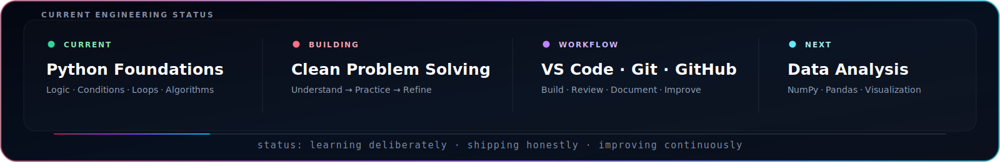
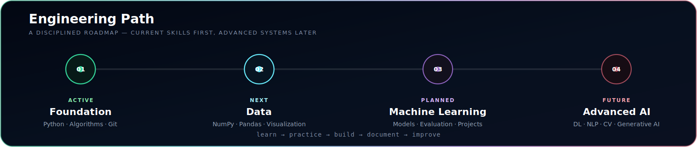

<div align="center">



<br/>

<a href="https://thismieo.github.io">
  
</a>
<a href="https://github.com/thismieo/thismieo.github.io">
  
</a>
<a href="mailto:thismieo@gmail.com">
  
</a>
<a href="https://www.kaggle.com/thismieo">
  
</a>

</div>

<br/>



---

## 01 / About

I am **Mohammed Muayad**, an **AI Engineering Student** from Baghdad, Iraq. I am building a disciplined foundation in programming, algorithms, data, and intelligent systems—one verified skill at a time.

My work is centered on understanding concepts correctly, converting learning into practical code, and documenting progress through GitHub. I value clear engineering, honest project status, and continuous improvement over collecting technologies without mastering them.

> **A focused journey from programming foundations to intelligent systems.**

---

## 02 / Featured Work



### AI Engineering Portfolio

A responsive portfolio system designed to present my identity, learning journey, technical direction, and future projects through one consistent engineering experience.

**What it demonstrates**

- Responsive implementation across desktop and mobile layouts
- Semantic HTML, structured CSS, and modular JavaScript behavior
- Accessibility-aware navigation, interactions, and portrait viewer
- Performance cleanup, asset validation, and GitHub pull-request workflow
- A unified visual language built around dark navy, cyan, maroon, and neural-system signals

<div align="center">

<a href="https://thismieo.github.io">
  
</a>
<a href="https://github.com/thismieo/thismieo.github.io">
  
</a>

</div>

---

## 03 / Engineering Path



The roadmap is intentionally progressive. Technologies are marked according to their real status—not presented as active skills before their learning stage begins.

---

## 04 / Technology Direction

<table>
<tr>
<td width="33%" valign="top">

### Active Foundation

- **Python** — programming logic and problem-solving
- **Algorithms** — structured thinking and reusable solutions
- **Git** — version control and change history
- **GitHub** — publishing, review, and documentation
- **VS Code** — development and debugging workspace

**Status:** Active

</td>
<td width="33%" valign="top">

### Data Layer

- **NumPy** — numerical computing
- **Pandas** — data analysis and transformation
- **Jupyter** — experiments and notebooks
- **Matplotlib** — clear data visualization
- **Preprocessing** — reliable model inputs

**Status:** Next

</td>
<td width="33%" valign="top">

### Intelligent Systems

- **Scikit-learn** — machine-learning pipelines
- **PyTorch** — neural-network development
- **Computer Vision** — visual understanding
- **NLP & LLMs** — language intelligence
- **Generative AI** — intelligent content systems

**Status:** Planned

</td>
</tr>
</table>

---

## 05 / Engineering Principles

**Understand before scaling.** I prefer a correct foundation over rushing into advanced frameworks.

**Build evidence, not claims.** Skills should appear through repositories, documentation, decisions, and working results.

**Keep progress visible.** GitHub is the public record of what I learn, build, review, and improve.

**Design with purpose.** Visual quality should support clarity, usability, and technical credibility.

---

## 06 / Current Direction

```text
NOW       Python foundations · algorithms · clean logic
BUILDING  Consistent engineering workflow and documented practice
NEXT      Data analysis · NumPy · Pandas · visualization
LATER     Machine learning · deep learning · intelligent systems
```

My long-term direction includes responsible AI systems for healthcare, intelligent assistants, computer vision, smart services, and practical automation. Each direction will be represented by real projects when its technical foundation is ready.

---

## 07 / Connect

<div align="center">

<a href="https://thismieo.github.io">
  
</a>
<a href="mailto:thismieo@gmail.com">
  
</a>
<a href="https://www.kaggle.com/thismieo">
  
</a>

<br/><br/>

**Open to learning, collaboration, and meaningful engineering work.**

<br/>

<sub>Built and maintained by Mohammed Muayad · AI Engineering Student · 2026</sub>

</div>
