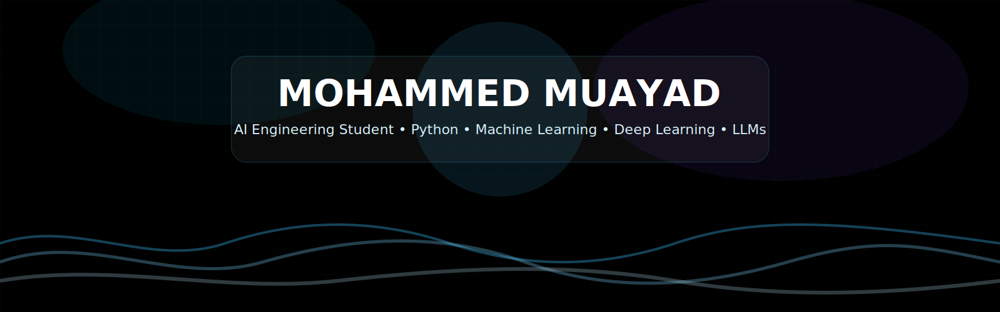
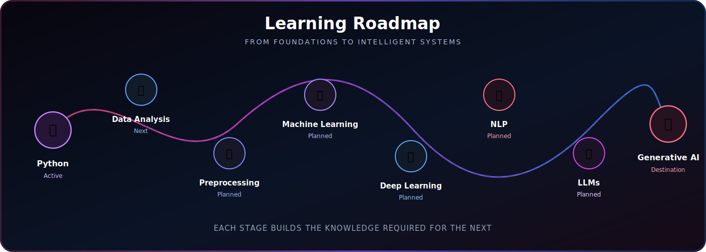
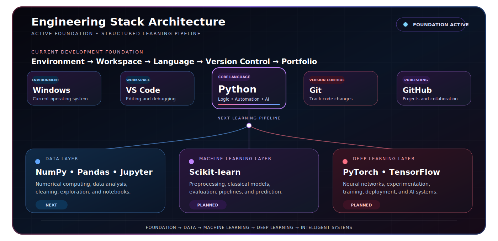

 

 

## 01. AI Identity

<table>
<tr>
<td width="50%" valign="top">

### 👤 Profile

- **Name:** Mohammed Muayad
- **Role:** AI Engineering Student
- **Location:** Baghdad, Iraq
- **Mission:** Build strong foundations in programming and artificial intelligence through consistent learning, practical projects, and public documentation.

</td>
<td width="50%" valign="top">

### 🧠 Current Focus

- Python fundamentals and clean programming practices
- Algorithms and problem-solving
- Git and GitHub workflow
- Preparing for Data Analysis and Machine Learning

</td>
</tr>
</table>

> **I am building my skills from the ground up — one concept, one project, and one commit at a time. This profile documents that journey publicly.**

## 02. About Me

I am an **AI Engineering Student** focused on developing practical, long-term skills in programming, data, and intelligent systems. My current priority is mastering the fundamentals correctly before moving into advanced topics.

I use this GitHub profile to document my progress, publish future projects, and demonstrate consistency. My goal is not to collect technologies without understanding them; it is to build a solid engineering foundation and turn what I learn into real work.

> **Vision:** *The work should speak before I do.*

### 🌍 Artificial Intelligence & the Future

Artificial intelligence helps transform data into decisions, automate repetitive work, improve healthcare, support safer transportation, enhance public services, and create tools that solve complex problems at scale.

My long-term path includes **Data Analysis, Machine Learning, Deep Learning, Computer Vision, Natural Language Processing, Robotics, Large Language Models, and Generative AI**. Each area contributes a different capability, but together they form the foundation of modern intelligent systems.

## 03. Progress Status

 

### 📚 Learning Domains

| Domain | What It Builds |
|---|---|
| **🐍 Python Fundamentals** | The programming foundation for writing logic, functions, loops, data structures, and clean reusable code. |
| **📊 Data Analysis** | The ability to inspect, organize, visualize, and understand data before building intelligent models. |
| **🧹 Data Preprocessing** | The process of cleaning data, handling missing values, encoding categories, and preparing reliable model inputs. |
| **🤖 Machine Learning** | Algorithms that learn patterns from data to classify, predict, recommend, or detect unusual behavior. |
| **🧠 Deep Learning** | Neural networks capable of learning complex patterns in images, language, audio, and large datasets. |
| **👁️ Computer Vision** | Systems that understand images and video for detection, recognition, tracking, and visual automation. |
| **💬 NLP** | Techniques that allow machines to understand, process, and generate human language. |
| **🚀 LLMs & Generative AI** | Advanced models that generate text, code, images, and intelligent responses from learned knowledge. |

## 04. Tech Stack

<table>
<tr>
<td width="50%" valign="top">

### ⚙️ Current Toolkit

- [**Python**](https://www.python.org/) — Core language for programming logic, automation, data, and future AI development.
- [**Visual Studio Code**](https://code.visualstudio.com/) — Main workspace for writing, running, organizing, and debugging code.
- [**Git**](https://git-scm.com/) — Version-control system for tracking changes and building disciplined development habits.
- [**GitHub**](https://github.com/) — Platform for publishing projects, documenting progress, and collaborating publicly.
- [**Windows**](https://www.microsoft.com/windows) — Current operating environment for development and learning.

</td>
<td width="50%" valign="top">

### 🚀 Next Learning Layer

- [**NumPy**](https://numpy.org/) — Fast numerical arrays and mathematical operations for data and machine learning.
- [**Pandas**](https://pandas.pydata.org/) — Structured data analysis, cleaning, transformation, and exploration.
- [**Jupyter**](https://jupyter.org/) — Interactive notebooks for experiments, explanations, visualizations, and analysis.
- [**Scikit-learn**](https://scikit-learn.org/) — Practical machine-learning models, preprocessing, evaluation, and pipelines.
- [**PyTorch**](https://pytorch.org/) — Flexible deep-learning framework for neural networks and research-oriented projects.
- [**TensorFlow**](https://www.tensorflow.org/) — Scalable framework for building and deploying intelligent neural systems.

</td>
</tr>
</table>

> **Technology strategy:** Build a strong programming foundation first, expand into data tools, then move into machine learning and deep learning with practical projects.

## 05. Featured AI Focus Areas

<table>
<tr>
<td width="33%" valign="top">

### 👁️ Computer Vision

Image classification, object detection, visual recognition, and intelligent systems that understand images and video.

**Future direction:** Smart visual analysis projects.

</td>
<td width="33%" valign="top">

### 🤖 Robotics Programming

Combining software, sensors, decision-making, and automation to create machines that interact with the real world.

**Future direction:** Intelligent robotic control.

</td>
<td width="33%" valign="top">

### 🏛️ Government Systems

AI systems that can improve digital services, document processing, public-data analysis, and operational efficiency.

**Future direction:** Responsible public-sector automation.

</td>
</tr>
<tr>
<td width="33%" valign="top">

### 🚘 Autonomous Systems

Computer vision, sensors, prediction, and decision-making for safer and more intelligent transportation systems.

**Future direction:** Vehicle perception and assistance.

</td>
<td width="33%" valign="top">

### ❤️ Medical AI

Using data and deep learning to support disease-risk analysis, medical-image understanding, and clinical decision support.

**Future direction:** Heart-disease analysis projects.

</td>
<td width="33%" valign="top">

### 🧠 Intelligent Assistants

NLP, LLMs, and generative AI systems that understand requests, retrieve knowledge, and provide useful responses.

**Future direction:** Arabic and domain-specific assistants.

</td>
</tr>
</table>

> Future projects will be published with clear documentation, datasets, notebooks, results, limitations, and lessons learned.

## 06. GitHub Analytics

  

| Signal | Purpose |
|:---:|---|
| **Repositories** | Projects, experiments, documentation, and future AI implementations. |
| **Contributions** | A visible record of consistent learning, commits, and project development. |
| **Activity** | Public progress that shows how knowledge is converted into practical work. |

> This section intentionally uses stable GitHub links instead of unreliable external images, preventing broken analytics cards.

## 07. Goals

<table>
<tr>
<td width="33%" align="center" valign="top">

### 🐍 Strong Foundations

Master Python, algorithms, clean code, and problem-solving.

**Status:** 🔄 Active

</td>
<td width="33%" align="center" valign="top">

### 📊 Data Skills

Learn NumPy, Pandas, visualization, preprocessing, and analysis.

**Status:** ⏳ Next

</td>
<td width="33%" align="center" valign="top">

### 🤖 Machine Learning

Understand models, evaluation, feature engineering, and real use cases.

**Status:** ⏳ Planned

</td>
</tr>
<tr>
<td width="33%" align="center" valign="top">

### 🧠 Advanced AI

Study Deep Learning, Computer Vision, NLP, LLMs, and Generative AI.

**Status:** ⏳ Planned

</td>
<td width="33%" align="center" valign="top">

### 🚀 Project Portfolio

Build and document more than ten practical AI projects.

**Status:** ⏳ Building path

</td>
<td width="33%" align="center" valign="top">

### 🌍 Professional Growth

Contribute to open source and develop a credible AI engineering portfolio.

**Status:** 🔄 Continuous

</td>
</tr>
</table>

## 08. Journey

- **Started:** June 4, 2026
- **Current phase:** Programming and AI foundations
- **Approach:** Learn → Practice → Build → Document → Improve

> *Every expert started somewhere. Progress begins when consistency becomes a habit.*

## 09. Connect With Me

<table>
<tr>
<td width="33%" align="center" valign="top">

### 📧 Public Email

For professional communication, learning opportunities, and collaboration.

</td>
<td width="33%" align="center" valign="top">

### 💼 Personal Email

For direct and personal communication.

</td>
<td width="33%" align="center" valign="top">

### 📊 Kaggle

For future datasets, notebooks, competitions, and data-science work.

</td>
</tr>
</table>

### 📸 Instagram

Personal updates, visual moments, and selected highlights from the journey.

  

  

**Open to learning, collaboration, and building meaningful AI projects.**

 

