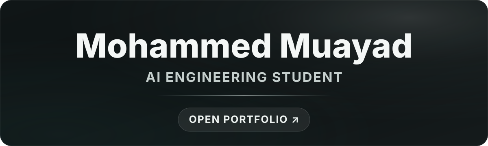

<div align="center">

<a href="https://thismieo.github.io" aria-label="Open Mohammed Muayad's portfolio">
  
</a>

</div>

## About

I am **Mohammed Muayad**, an AI Engineering student from Baghdad, Iraq. I am building a disciplined path from programming foundations to applied intelligent systems, with an emphasis on correct understanding, practical code, and documented progress.

> **Build evidence, not claims.** Every skill should eventually be supported by working code, clear documentation, and a real project.

## Current focus

```text
NOW    Python · Algorithms · Problem solving
NEXT   NumPy · Pandas · Data analysis
LATER  Machine learning · Deep learning · NLP
```

## Featured work

### AI Engineering Portfolio

A responsive portfolio built to present my technical direction, learning journey, and project work through one consistent experience.

- Responsive layouts for desktop and mobile
- Semantic HTML, structured CSS, and JavaScript interactions
- Accessibility-aware navigation and interface behavior
- Performance cleanup, asset validation, and GitHub-based publishing

**Live:** [thismieo.github.io](https://thismieo.github.io)  
**Code:** [thismieo/thismieo.github.io](https://github.com/thismieo/thismieo.github.io)

## Working with

`Python` · `Git` · `GitHub` · `VS Code` · `HTML` · `CSS` · `JavaScript`

## Learning next

`NumPy` · `Pandas` · `Matplotlib` · `Scikit-learn`

## Engineering direction

```text
FOUNDATIONS  →  DATA  →  MACHINE LEARNING  →  INTELLIGENT SYSTEMS
```

My long-term direction includes practical automation, computer vision, language systems, and responsible AI applications. These areas will appear here only when they are supported by real work.

## Connect

- **Kaggle:** [kaggle.com/thismieo](https://www.kaggle.com/thismieo)
- **Email:** [thismieo@gmail.com](mailto:thismieo@gmail.com)

<sub>Learning in public · Building step by step · Baghdad, Iraq</sub>
